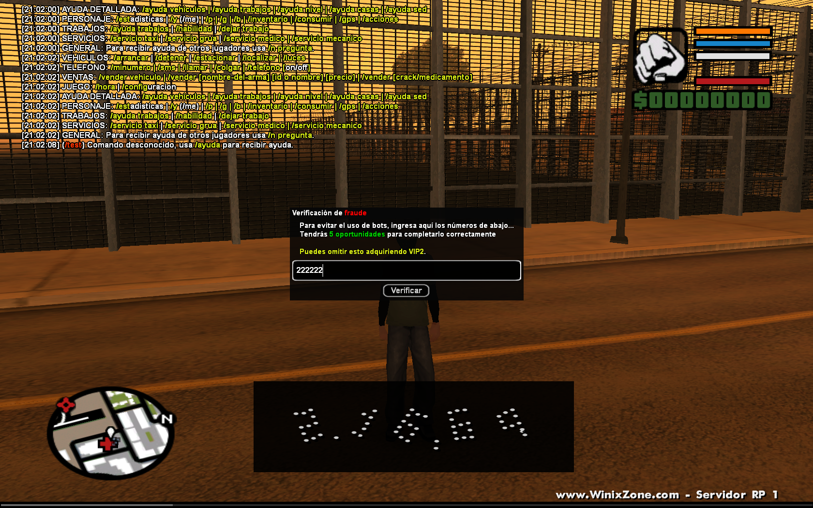
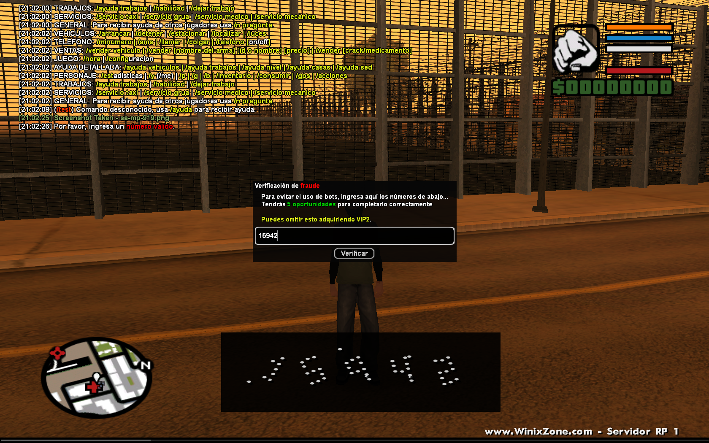
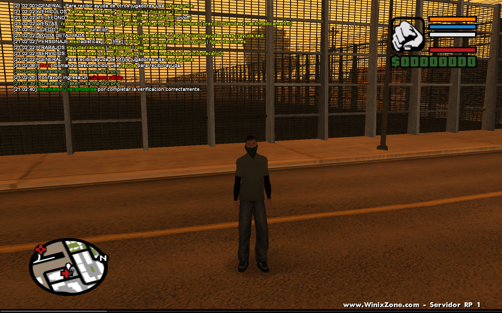

# Legacy PawnScript Project: Anti-AFK Captcha System (20XX)

> **⚠️ Historical Note:** This repository contains code developed entirely by me at the age of **16**. It represents my beginnings in programming logic and server scripting (SA-MP), long before the rise of generative AI. It is shared to document my early problem-solving skills and system design capabilities.

---

## Project Context
At the time, many online gaming communities (specifically SA-MP servers) faced a major challenge: users utilizing automation tools (bots) to farm in-game rewards by leaving their characters working for long periods of time.

By observing the behavior of major servers from a player's perspective, I decided to **replicate and develop from scratch** a functional human verification system (Captcha). This was achieved through functional reverse engineering, without access to any external source code or proprietary implementations.

---

## Technical Challenges Overcome
* **Functional Reverse Engineering:** Replicating complex user-end logic and server-side validation flows based solely on external observation.
* **Verification Logic:** Implementing a robust flow where the system detects task completion and withholds rewards until a successful real-time validation is performed.
* **Dynamic UI/UX:** Utilizing **TextDraws and Dialogs** to create interactive interfaces that force human input before processing server-side variables.
* **State Management:** Controlling player states (freezing movement and blocking commands) to ensure the integrity of the verification process.

---

## What This Project Demonstrates
1.  **Analytical Thinking:** Identifying a systemic problem (inflation/automation) and crafting a technical solution to mitigate it.
2.  **Event-Driven Architecture:** A deep understanding of how to handle requests, timers, and callbacks in a high-concurrency multiplayer environment.
3.  **Foundation & Evolution:** It showcases the logical mindset and persistence I had at a young age, which served as the foundation for my professional career.

---

## Screenshots

  
  
  

---

## Tech Stack
* **Language:** PawnScript (C-like syntax)
* **Environment:** SA-MP Server Scripting

---

## Disclaimer
This project is shared strictly for **educational and historical purposes**. It does not reflect my current coding standards or best practices. It is not intended to promote cheating or the bypassing of protections, but rather to document the technical evolution of a developer.
